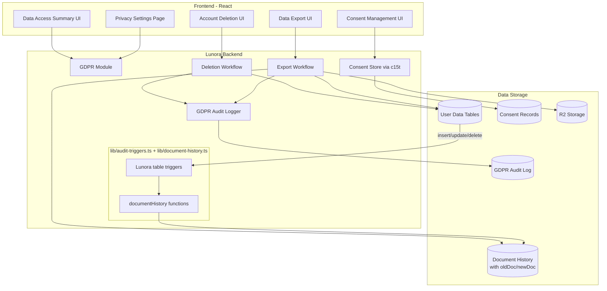
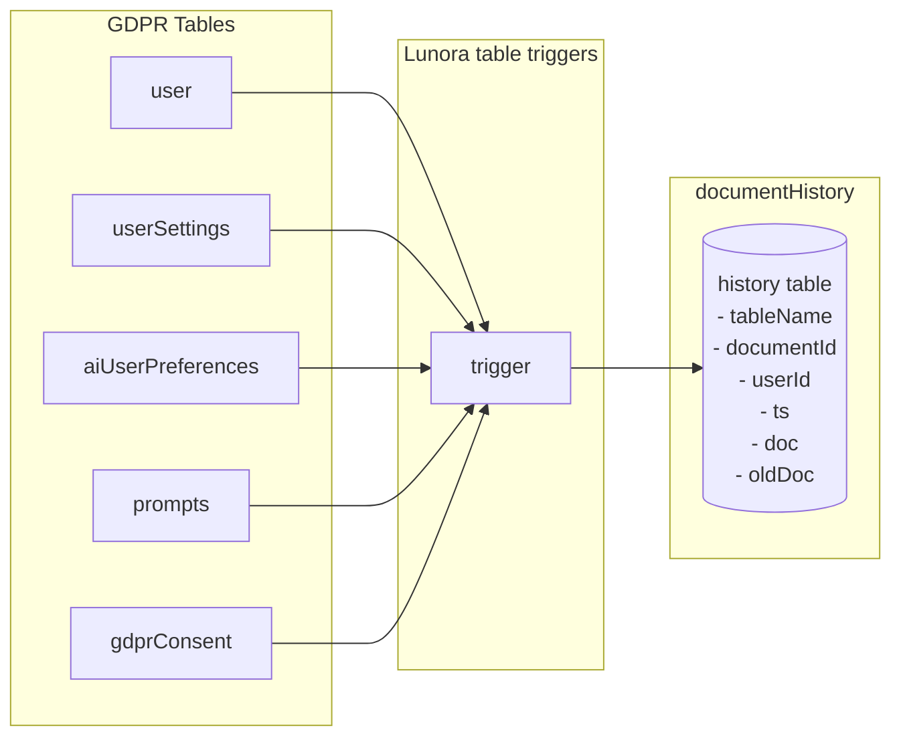
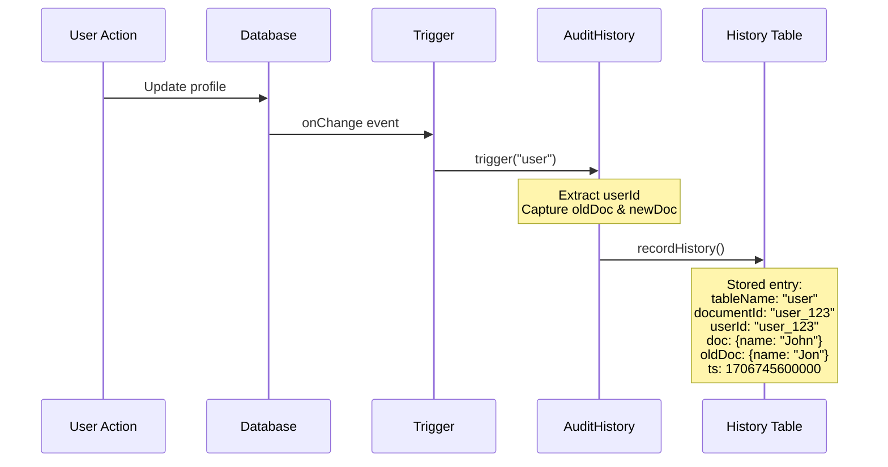
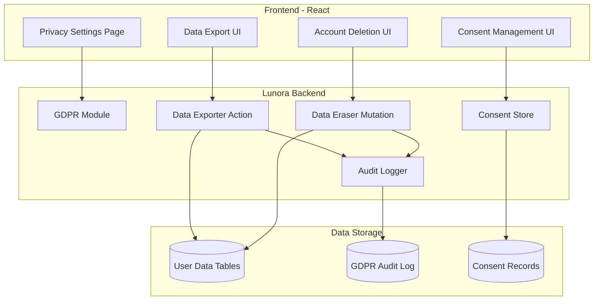
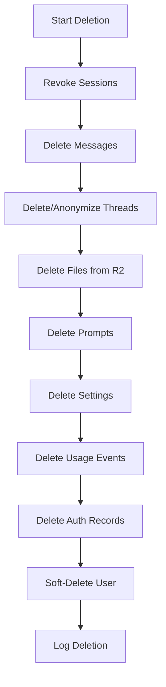

# GDPR Compliance Implementation

This module implements full EU GDPR (General Data Protection Regulation) compliance for the chat application, providing automated self-service capabilities for all core GDPR rights.

## GDPR Resources

### Official GDPR Documentation

- **[GDPR Official Text](https://eur-lex.europa.eu/legal-content/EN/TXT/?uri=CELEX:32016R0679)** - Full regulation text
- **[GDPR.eu Guide](https://gdpr.eu/what-is-gdpr/)** - Comprehensive GDPR guide
- **[ICO GDPR Guide](https://ico.org.uk/for-organisations/guide-to-data-protection/guide-to-the-general-data-protection-regulation-gdpr/)** - UK Information Commissioner's Office guide

### Key GDPR Articles Implemented

- **[Article 12](https://gdpr-info.eu/art-12-gdpr/)** - Transparent information, communication and modalities for the exercise of the rights of the data subject
- **[Article 15](https://gdpr-info.eu/art-15-gdpr/)** - Right of access by the data subject (Right to Access)
- **[Article 17](https://gdpr-info.eu/art-17-gdpr/)** - Right to erasure ('right to be forgotten')
- **[Article 20](https://gdpr-info.eu/art-20-gdpr/)** - Right to data portability
- **[Article 30](https://gdpr-info.eu/art-30-gdpr/)** - Records of processing activities (audit logging)

## Implementation Overview

### Architecture



### Module Structure

```text
backend/lunora/gdpr/
├── README.md                    # This file
├── module.ts                    # Module metadata (gdprAuditLog, gdprConsent, gdprRequests; tables live in schema.ts)
├── constants.ts                 # GDPR constants (expiry times, timeouts)
├── functions.ts                 # Public API (queries, mutations, actions)
├── workflow-actions.ts          # Actions to start workflows
├── steps.ts                     # Data collection steps for export
├── steps/
│   ├── deletion-steps.ts        # Deletion steps (cascade delete)
│   ├── email-steps.ts           # Email notification steps
│   └── ...                      # Residual deletion and other steps
├── retention.ts                 # Activity retention sweep
├── request-sweeps.ts            # Export cleanup and request timeout crons
└── workflows/
    ├── export-workflow.ts       # Data export workflow
    └── deletion-workflow.ts     # Account deletion workflow

backend/lunora/lib/
├── audit-triggers.ts            # Audit history table triggers configuration
└── document-history.ts          # Document version history (documentHistory functions)
```

## How It Works

### Article 15: Right of Access

**Implementation:** `getDataAccessSummary` query

Users can view a summary of their personal data without generating an export file. This provides quick access to:

- Profile information (email, name, account creation date)
- Data counts (files, prompts, settings, GDPR requests)

**Usage:**

```typescript
const summary = await ctx.runQuery(api.gdpr.functions.getDataAccessSummary, {});
```

**UI Component:** `app/src/features/settings/components/privacy/data-access.tsx`

### Article 20: Right to Data Portability

**Implementation:** `dataExportWorkflow` (Lunora workflow)

Users can request a complete export of all their personal data in JSON format. The export includes:

1. **Profile Data** - User account information
2. **Settings** - User preferences and AI settings
3. **Conversations** - All threads and messages
4. **Files** - File metadata (actual files stored separately)
5. **Prompts** - Saved prompts and history
6. **Usage History** - AI usage tracking events

**Workflow Steps:**

1. User requests export via `requestDataExport` mutation
2. Workflow collects data from all tables (parallel queries)
3. Data is formatted as JSON
4. JSON is uploaded to R2
5. Signed download URL is generated (7-day expiry)
6. Email notification sent to user

**Usage:**

```typescript
// Request export
await ctx.runMutation(api.gdpr.functions.requestDataExport, {});

// Check status
const status = await ctx.runQuery(api.gdpr.functions.getExportStatus, {});

// Download (when ready)
const { url } = await ctx.runAction(api.gdpr.functions.getExportDownloadUrl, {});
```

**UI Component:** `app/src/features/settings/components/privacy/data-export.tsx`

**Export Format:**

```json
{
  "exportVersion": "1.0",
  "exportDate": "2026-01-02T10:30:00.000Z",
  "dataSubject": {
    "id": "user_123",
    "email": "user@example.com"
  },
  "profile": { ... },
  "settings": { ... },
  "conversations": [ ... ],
  "files": { ... },
  "prompts": { ... },
  "usageHistory": [ ... ]
}
```

### Article 17: Right to Erasure

**Implementation:** `accountDeletionWorkflow` (Lunora workflow)

Users can request permanent deletion of their account and all associated personal data. The deletion process:

1. **Revoke Sessions** - Log out user from all devices
2. **Delete Messages & Threads** - Remove all conversations
3. **Delete Files** - Remove files from R2 storage and database
4. **Delete Prompts** - Remove saved prompts and history
5. **Delete Settings** - Remove user preferences
6. **Delete Usage Events** - Remove usage tracking data
7. **Delete Auth Records** - Remove accounts and sessions
8. **Send Confirmation** - Email confirmation of deletion

**Usage:**

```typescript
// Request deletion
await ctx.runMutation(api.gdpr.functions.requestAccountDeletion, {});

// Check status
const status = await ctx.runQuery(api.gdpr.functions.getDeletionStatus, {});
```

**UI Component:** `app/src/features/settings/components/privacy/account-deletion.tsx`

**Important:** Deletion is immediate and irreversible. Users must type "DELETE" to confirm.

### Consent Management

**Implementation:** Integration with `c15t` library

Consent is managed via the `c15t` React library, which provides:

- Cookie banner on first visit
- Consent manager dialog for granular preferences
- Integration with analytics (PostHog) to respect consent

**UI Component:** `app/src/features/settings/components/privacy/consent-preferences.tsx`

**Configuration:** `app/src/routes/__root.tsx` (ConsentManagerProvider)

### Audit Logging

The application uses two complementary audit systems:

#### 1. GDPR Audit Log (`gdprAuditLog` table)

High-level GDPR-related actions are logged:

- Export requests, completions, downloads
- Deletion requests and completions
- Consent grants and revocations
- Data access events
- System actions (timeouts, cleanup)

**Usage:**

```typescript
await ctx.runMutation(internal.gdpr.functions.logAudit, {
    action: "export_requested",
    details: JSON.stringify({ requestId: "..." }),
    performedBy: userId,
    userId: "...",
});
```

#### 2. Document Audit History (`documentHistory` table)

Detailed change tracking for GDPR-relevant tables using the table triggers in `lib/audit-triggers.ts`:



**Tracked Tables:**

| Table               | userId Extraction | Purpose                |
| ------------------- | ----------------- | ---------------------- |
| `user`              | `doc._id`         | Profile changes        |
| `userSettings`      | `doc.userId`      | Preference changes     |
| `aiUserPreferences` | `doc.userId`      | AI settings changes    |
| `prompts`           | `doc.userId`      | Prompt CRUD operations |
| `gdprConsent`       | `doc.userId`      | Consent changes        |

**Configuration:** See `backend/lunora/lib/audit-triggers.ts`

**Features:**

- **Change diff tracking** - Stores both `doc` (new state) and `oldDoc` (previous state)
- **User activity queries** - Efficient `by_user_ts` index for Article 15 compliance
- **Point-in-time queries** - Retrieve document state at any timestamp
- **Vacuum/cleanup** - Batched deletion with configurable retention

**Usage:**

```typescript
// List all changes for a user (Article 15)
const activity = await ctx.runQuery(internal.lib.document_history.listUserActivity, { userId });

// Get document state at a specific time
const userAtTime = await ctx.runQuery(internal.lib.document_history.getDocumentAtTime, {
    documentId: docId,
    tableName: "user",
    timestamp,
});

// Vacuum old entries (retention policy) is run by the vacuumDocumentHistory job, see below
```

**Documentation:** See `backend/lunora/lib/document-history.ts` (the functions and their retention notes)

### Audit History Data Flow



### Retention Policies

Audit history supports configurable retention via the vacuum feature:

| Retention Period | Use Case                         |
| ---------------- | -------------------------------- |
| 90 days          | Standard compliance              |
| 1 year           | Financial/healthcare regulations |
| 7 years          | Tax/accounting requirements      |

**Vacuum Cron Configuration:** `vacuumDocumentHistory` in `backend/lunora/crons.ts` (a `PERIODIC_JOBS` entry) keeps 90 days of history and re-runs itself while a batch comes back full.

### Activity retention

`gdpr/retention.ts#pruneRetainedActivity` runs in every shard's housekeeping
sweep (`lib/shard-housekeeping.ts`), a bounded batch per table per run:

| Table          | Kept                                               | Why                                                                           |
| -------------- | -------------------------------------------------- | ----------------------------------------------------------------------------- |
| `usageDaily`   | 400 days                                           | The usage page's per-day rollup; a year plus a month of history is enough.    |
| `subAgentRuns` | 90 days, finished runs only (`succeeded`/`failed`) | The answer was already posted into the parent thread; the row is bookkeeping. |

Both are also in the export (`collectActivityForExport`, with
`knowledgeCollections`) and deleted with the account in their own batched steps
(`deleteUserUsageDaily`, `deleteUserSubAgentRuns`).

The rollup's bookkeeping — `usageReplies` (the id of each reply it counted, so
none counts twice) and `usageBackfill` (the one-shot backfill's position) — is
deleted in `deleteUserUsageDaily` too. It is not exported: it holds message ids
and counters derived from conversations the export already carries.
`usageReplies` keys are pruned two days after the user's backfill finishes
(`usage/backfill.ts#sweepUsageRollup`).

### Request Timeout Handling

**Implementation:** `handleGdprRequestTimeouts` cron job

GDPR Article 12 requires requests to be fulfilled within 30 days. The cron job:

- Runs daily
- Checks for requests older than 30 days
- Marks timed-out requests as "failed"
- Logs timeout events in audit log

**Configuration:** `backend/lunora/crons.ts`

## Data Inventory

The following tables contain user personal data and are included in exports/deletions:

| Table               | Location               | Data Type                    |
| ------------------- | ---------------------- | ---------------------------- |
| `user`              | Better Auth            | Profile (name, email, image) |
| `account`           | Better Auth            | Auth providers, tokens       |
| `session`           | Better Auth            | Active sessions              |
| `userSettings`      | `schema.ts`            | Preferences, shortcuts       |
| `aiUserPreferences` | `schema.ts`            | AI settings, encrypted keys  |
| `threads`           | `schema.ts`            | Chat conversations           |
| `messages`          | `schema.ts`            | Chat messages                |
| `files`             | `schema.ts`            | Uploaded files               |
| `folders`           | `schema.ts`            | Folder structure             |
| `prompts`           | `schema.ts`            | Saved prompts                |
| `promptHistory`     | `schema.ts`            | Prompt versions              |
| `threadAccess`      | `schema.ts`            | Shared thread permissions    |
| `threadInvites`     | `schema.ts`            | Thread sharing invites       |

**Not in exports or deletions, by design: `wsTicket`** (raw D1, `lib/ws-ticket.ts`).
Each row is a live-query socket ticket: a SHA-256 hash, a user id, a session id
and an expiry 30 seconds after minting. It is deleted when redeemed, and an
expired one is purged by the next mint or by the Worker's one-minute cron tick
(`src/server.ts#scheduled`), so no row outlives its minting by more than about
90 seconds. Account deletion therefore does not visit it: within that window a
deleted user's rows are gone on their own. Nor can a ticket minted just before
the deletion be redeemed: `redeemWsTicket` also requires the session it was
minted under to still exist (any session of the user, for a ticket that names
none), and `revokeUserSessions` is the workflow's first step — so from then on
every outstanding ticket of the user authenticates nothing, even inside its 30s
(`lib/ws-ticket.test.ts` pins this). A sign-out ends them the same way. It holds
no content worth exporting.

## API Reference

### Queries

- `getExportStatus()` - Get current export request status
- `getDeletionStatus()` - Get current deletion request status
- `getGdprStatus()` - Get both export and deletion status (optimized)
- `getDataAccessSummary()` - Get data access summary (Article 15)

### Mutations

- `requestDataExport()` - Request a data export
- `requestAccountDeletion()` - Request account deletion
- `cancelStuckExport()` - Cancel a stuck export request

### Actions

- `getExportDownloadUrl()` - Get signed download URL for completed export

### Internal Functions

- `updateRequestProgress()` - Update workflow progress
- `logAudit()` - Log audit event
- `getRequestById()` - Get request by ID
- `getExportRequest()` - Get export request for user

## Configuration

### Environment Variables

- `VITE_DPO_EMAIL` - Data Protection Officer email
- `VITE_DPO_NAME` - Data Protection Officer name
- `VITE_PRIVACY_POLICY_URL` - Privacy policy URL
- `VITE_C15T_MODE` - c15t consent mode ("offline" or "c15t")
- `VITE_C15T_BACKEND_URL` - c15t backend URL (if using online mode)

### Constants

- `EXPORT_EXPIRY_DAYS` - Export download links expire after 7 days
- `GDPR_REQUEST_TIMEOUT_DAYS` - Requests timeout after 30 days
- `DELETION_RETENTION_DAYS` - Deletion retention period (30 days)

## Cron Jobs

### `cleanupExpiredExports`

- **Frequency:** Every 6 hours
- **Purpose:** Delete expired export files from storage
- **Location:** `backend/lunora/gdpr/request-sweeps.ts` (scheduled from `crons.ts`)

### `handleGdprRequestTimeouts`

- **Frequency:** Daily
- **Purpose:** Mark requests older than 30 days as failed
- **Location:** `backend/lunora/gdpr/request-sweeps.ts` (scheduled from `crons.ts`)

## Frontend Components

All privacy UI components are located in `app/src/features/settings/components/privacy/`:

- `privacy-settings.tsx` - Main privacy dashboard
- `data-access.tsx` - Article 15 data access summary
- `data-export.tsx` - Article 20 data export UI
- `account-deletion.tsx` - Article 17 account deletion UI
- `consent-preferences.tsx` - Consent management UI
- `dpo-contact.tsx` - DPO contact information
- `privacy-policy.tsx` - Privacy policy link

## Testing

### Manual Testing

1. **Export Flow:**
    - Request export from privacy settings
    - Check workflow progress
    - Download completed export
    - Verify export contains all data

2. **Deletion Flow:**
    - Request account deletion
    - Confirm with "DELETE"
    - Verify account is deleted
    - Check confirmation email

3. **Access Summary:**
    - View data access summary
    - Verify counts are accurate

### Audit Log Verification

Check `gdprAuditLog` table for:

- All export/deletion requests logged
- System actions logged
- Proper timestamps and user attribution

## Compliance Checklist

- ✅ Article 12: 30-day response time (cron job enforces)
- ✅ Article 15: Right of access (data access summary + `listUserActivity()`)
- ✅ Article 17: Right to erasure (account deletion + vacuum)
- ✅ Article 20: Right to data portability (data export)
- ✅ Article 30: Records of processing (dual audit logging)
- ✅ Consent management (c15t integration)
- ✅ DPO contact information
- ✅ Privacy policy link
- ✅ Email notifications for requests
- ✅ Secure data handling (signed URLs, encryption)
- ✅ Change tracking with diff (`oldDoc` + `newDoc`)
- ✅ User activity indexing (efficient GDPR queries)
- ✅ Data retention policies (vacuum with configurable retention)

## Security Considerations

1. **Authentication:** All GDPR functions require authentication
2. **Authorization:** Users can only access their own data
3. **Secure Downloads:** Export files use signed URLs with expiration
4. **Audit Trail:** All actions are logged for compliance
5. **Data Minimization:** Only necessary data is collected and stored

## Performance Optimizations

1. **Combined Queries:** `getGdprStatus` reduces database calls
2. **Workflow Processing:** Long-running operations use Lunora workflows
3. **Parallel Data Collection:** Export workflow collects data in parallel
4. **Client-Side Caching:** live queries (`apps/web/src/lib/lunora/live-queries.ts`) keep the TanStack Query cache current

## Troubleshooting

### Export Stuck in "Processing"

1. Check workflow status in the Lunora Studio
2. Review workflow logs for errors
3. Use `cancelStuckExport` to cancel and retry

### Deletion Not Completing

1. Check deletion workflow logs
2. Verify all deletion steps completed
3. Check for foreign key constraints

### Slow Queries

1. Check if indexes are properly created
2. Review query execution times in dashboard
3. Consider using `getGdprStatus` instead of separate queries

---

## Original Implementation Plan

<details>
<summary>Click to expand the original implementation plan</summary>

````markdown
---
name: GDPR Compliance Implementation
overview: Implement full GDPR compliance for the chat application, including automated data portability (Article 20), right to erasure (Article 17), consent management, DPO contact integration, and audit logging across all user data tables in Lunora.
todos:
    - id: gdpr-schema
      content: Create GDPR schema with request tracking, consent, and audit tables
      status: completed
    - id: data-export
      content: Implement data export action collecting all user data in JSON format
      status: completed
      dependencies:
          - gdpr-schema
    - id: data-erasure
      content: Implement account deletion with cascade delete across all tables
      status: completed
      dependencies:
          - gdpr-schema
    - id: consent-backend
      content: Add consent storage and retrieval functions
      status: completed
      dependencies:
          - gdpr-schema
    - id: privacy-ui
      content: Create privacy settings UI with export, deletion, and consent controls
      status: completed
      dependencies:
          - data-export
          - data-erasure
          - consent-backend
    - id: dpo-integration
      content: Add DPO contact configuration and display in settings
      status: completed
    - id: cron-cleanup
      content: Add scheduled job for expired export cleanup and deletion queue processing
      status: completed
      dependencies:
          - data-export
          - data-erasure
    - id: documentation
      content: Update privacy documentation with GDPR rights information
      status: completed
---

# GDPR Compliance Implementation Plan

## Overview

This plan implements full EU GDPR compliance for your multi-region chat application. The implementation covers all core GDPR rights with fully automated self-service capabilities.

## Data Inventory

Based on codebase analysis, the following tables contain user personal data:

| Table               | Location                                                                | Data Type                    |
| ------------------- | ----------------------------------------------------------------------- | ---------------------------- |
| `user`              | Better Auth                                                             | Profile (name, email, image) |
| `account`           | Better Auth                                                             | Auth providers, tokens       |
| `session`           | Better Auth                                                             | Active sessions              |
| `userSettings`      | [schema.ts](../schema.ts)                                               | Preferences, shortcuts       |
| `aiUserPreferences` | [schema.ts](../schema.ts)                                               | AI settings, encrypted keys  |
| `threads`           | [schema.ts](../schema.ts)                                               | Chat conversations           |
| `messages`          | [schema.ts](../schema.ts)                                               | Chat messages                |
| `files`             | [schema.ts](../schema.ts)                                               | Uploaded files               |
| `folders`           | [schema.ts](../schema.ts)                                               | Folder structure             |
| `prompts`           | [schema.ts](../schema.ts)                                               | Saved prompts                |
| `promptHistory`     | [schema.ts](../schema.ts)                                               | Prompt versions              |
| `threadAccess`      | [schema.ts](../schema.ts)                                               | Shared thread permissions    |
| `threadInvites`     | [schema.ts](../schema.ts)                                               | Thread sharing invites       |

## Architecture


````

## Implementation Phases

### Phase 1: Schema and Infrastructure

Create new GDPR-specific tables in `backend/lunora/schema.ts`:

```typescript
// GDPR request tracking
gdprRequests: defineTable({
    completedAt: v.optional(v.number()),
    downloadUrl: v.optional(v.string()),
    errorMessage: v.optional(v.string()),
    expiresAt: v.optional(v.number()),
    requestedAt: v.number(),
    requestType: v.union(v.literal("export"), v.literal("deletion"), v.literal("access")),
    status: v.union(v.literal("pending"), v.literal("processing"), v.literal("completed"), v.literal("failed")),
    userId: v.string(),
});

// Consent records
gdprConsent: defineTable({
    granted: v.boolean(),
    grantedAt: v.number(),
    ipAddress: v.optional(v.string()),
    purpose: v.string(), // "analytics", "marketing", "ai_training"
    revokedAt: v.optional(v.number()),
    userAgent: v.optional(v.string()),
    userId: v.string(),
});

// Audit log for compliance
gdprAuditLog: defineTable({
    action: v.string(),
    details: v.string(),
    performedBy: v.string(), // userId or "system"
    timestamp: v.number(),
    userId: v.string(),
});
```

### Phase 2: Data Export (Article 20)

Create `backend/lunora/gdpr/functions.ts` with:

1. **`requestDataExport`** - Initiates export, creates tracking record
2. **`generateDataExport`** - Scheduled action that:

- Collects all user data from identified tables
- Formats as JSON with clear structure
- Generates downloadable archive
- Stores in temporary storage with 7-day expiry

3. **`getExportStatus`** - Query for export progress
4. **`downloadExport`** - Returns signed URL for download

Export format structure:

```json
{
  "exportDate": "2026-01-02T...",
  "dataSubject": { "id": "...", "email": "..." },
  "profile": { ... },
  "settings": { ... },
  "conversations": [ ... ],
  "files": [ ... ],
  "prompts": [ ... ],
  "usageHistory": [ ... ]
}
```

### Phase 3: Right to Erasure (Article 17)

Create deletion workflow:

1. **`requestAccountDeletion`** - Initiates with confirmation token
2. **`confirmAccountDeletion`** - After email verification:

- Soft-delete user record (for 30-day recovery)
- Hard-delete all personal data immediately
- Handle shared content (anonymize or transfer ownership)
- Revoke all sessions
- Send confirmation email

3. **`processDeletionQueue`** - Cron job for final cleanup after retention period

Deletion cascade order:



### Phase 4: Consent Management

Extend existing consent infrastructure in [show-banner.ts](app/src/lib/consent/show-banner.ts):

1. Add granular consent purposes (analytics, AI training, etc.)
2. Store consent records in Lunora
3. Provide UI for consent management in settings
4. Respect consent in all data processing

### Phase 5: Frontend UI

Create new settings section at `app/src/features/settings/components/privacy/`:

1. **`privacy-settings.tsx`** - Main privacy dashboard
2. **`data-export.tsx`** - Export request and download UI
3. **`account-deletion.tsx`** - Deletion flow with confirmation
4. **`consent-preferences.tsx`** - Granular consent toggles
5. **`dpo-contact.tsx`** - DPO contact information display

### Phase 6: DPO Integration

Add DPO contact configuration:

- Environment variable for DPO email
- Privacy settings section with DPO contact
- Link in footer and privacy policy

### Phase 7: Multi-Region Compliance

For your multi-region deployment:

1. Document data flows in privacy policy
2. Implement Standard Contractual Clauses reference
3. Add data location indicator in settings

## Key Files to Create/Modify

| File                                            | Action                    |
| ----------------------------------------------- | ------------------------- |
| `backend/lunora/schema.ts`                      | Modify (add GDPR tables)  |
| `backend/lunora/gdpr/functions.ts`              | Create                    |
| `backend/lunora/gdpr/constants.ts`              | Create                    |
| `backend/lunora/crons.ts`                       | Modify (add cleanup cron) |
| `app/src/features/settings/components/privacy/` | Create directory          |
| `app/src/routes/dashboard/settings.privacy.tsx` | Create                    |
| `docs/privacy.mdx`                              | Create/Update             |

## Timeline Estimate

- Phase 1 (Schema): 2-3 hours
- Phase 2 (Export): 4-6 hours
- Phase 3 (Erasure): 4-6 hours
- Phase 4 (Consent): 2-3 hours
- Phase 5 (Frontend): 4-6 hours
- Phase 6 (DPO): 1-2 hours
- Phase 7 (Multi-region): 2-3 hours

**Total: ~20-30 hours**

## Compliance Notes

- All GDPR requests must be fulfilled within 30 days (Article 12)

</details>

---

## License

This implementation is part of the Neore.chat application and follows GDPR compliance requirements for EU users.
